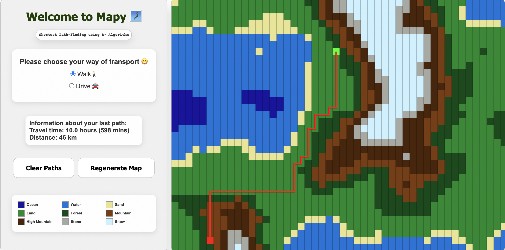

# Mapy 🗺️

**Mapy** is a **visual pathfinding tool** that computes optimal routes across randomly generated terrain maps using the A* algorithm, 
with support for **walking and driving modes**. It starts by
rendering a randomly generated map using a seed. The map can contain mountains, forests, lands, seas, oceans, sands and even stone and snowy tops.




## Features
* A* Algorithm - an informed search algorithm that leverages a heuristic function to guide its search towards the goal. This implementation uses the Manhattan heuristic as it is more efficient and provides better path optimizations.
* Simplex Noise for map generation.
* Different **speeds** for the different types of terrain.
* Choice for the **type of transport** from starting point to ending point.
* Displays **travel time and distance**.
* Map regenerates on button click and refresh of the page
* Map Legend with types of terrain
  
## How it works?
1. Select travel mode (🚶‍♂️ Walk or 🚗 Drive)
2. Click any two points on the map.
3. View the optimal path (red line) and travel information.

## Installation
1. Extract the ZIP file
2. Open a terminal in your project folder
3. Set up dependencies:
```sh
pip install -r requirements.txt
```
4. Run the application
```sh
python app.py
```
5. You should be able to see it at localhost in your browser 🙂
